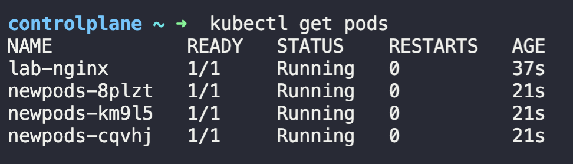

# 22-28

## 22

### YAML

설정 등에 활용하는 문법입니다.
간단하니 상세는 생략합시다.

### YAML in Kubernetes

```yaml
apiVersion:
kind:
metadata:


spec:


```

apiVersion과 kind는 필수입니다.

| kind       | apiVersion |
| ---------- | ---------- |
| Pod        | v1         |
| Service    | v1         |
| ReplicaSet | apps/v1    |
| Deployment | apps/v1    |

metadata는 실제 서버에 올라간 컴포넌트들을 관리하기 쉽게 하는 정보입니다.

- `name`은 현재 YAML로 배포할 컴포넌트의 이름입니다. 중복되면 안됩니다. 이후에 `kubectl`로 컴포넌트를 관리할 때 이 이름을 사용합니다.
- `labels`는 컴포넌트를 구분하기 위한 태그입니다. 키-값 쌍으로 자유롭게 지정할 수 있습니다.

spec은 컴포넌트의 세부 설정입니다.

### Pod spec

```YAML
spec:
  containers:
  - name: # 컨테이너의 이름입니다.
    image: # 컨테이너의 이미지 경로입니다.
  # ...
```

컨테이너는 여러개 적을 수 있습니다.

### Kubectl로 YAML pod 배포하기

`kubectl get pods`

현재 배포된 pod 목록을 확인합니다.

`kubectl apply -f pod-nginx.yaml`

pod-nginx.yaml에 정의된 pod를 배포합니다.

`kubectl describe pod nginx`

nginx pod의 상세 정보를 확인합니다.

`kubectl delete pod nginx`

nginx pod를 삭제합니다.

## 23. Demo - Pods with YAML

27장에 정리했습니다.

## 24

Practice 설명입니다.

## 25. Demo: Accessing Labs

실습 접속 방법이 안내됩니다.

## 26. Accessing the Labs

실습 접속 URL, 코드가 제공됩니다.

## 27. Practice Test - Pods

### Q1

> How many pods exist on the system?
>
> In the current(default) namespace.

`kubectl get pods` then you will see nothing.

### Q2

> Create a new pod with the nginx image.

```bash
echo "apiVersion: v1
kind: Pod
metadata:
  name: lab-nginx
  labels:
    app: nginx
spec:
  containers:
  - name: lab-nginx
    image: nginx
" > pod.yaml
```

`kubectl apply -f pod.yaml`

### Q3

> How many pods are created now?
>
> Note: We have created a few more pods. So please check again.

`kubectl get pods` then you will see 4 pods: 3 are suddenly created.



### Q4

> What is the image used to create the new pods?
>
> You must look at one of the new pods in detail to figure this out.

`kubectl describe pod newpods-8plzt` -> busybox

```txt
Name:             newpods-8plzt
Namespace:        default
Priority:         0
Service Account:  default
Node:             controlplane/192.5.196.3
Start Time:       Thu, 02 Nov 2023 04:00:37 +0000
Labels:           tier=busybox
Annotations:      <none>
Status:           Running
IP:               10.42.0.12
IPs:
  IP:           10.42.0.12
Controlled By:  ReplicaSet/newpods
Containers:
  busybox:
    Container ID:  containerd://9719d76a777ba63951d9ea92ac4f3f8117ee31f659580b7c0a6f8790834f6c51
    Image:         busybox
    Image ID:      docker.io/library/busybox@sha256:3fbc632167424a6d997e74f52b878d7cc478225cffac6bc977eedfe51c7f4e79
    Port:          <none>
    Host Port:     <none>
    Command:
      sleep
      1000
    State:          Running
      Started:      Thu, 02 Nov 2023 04:00:39 +0000
    Ready:          True
    Restart Count:  0
    Environment:    <none>
    Mounts:
      /var/run/secrets/kubernetes.io/serviceaccount from kube-api-access-df9gj (ro)
Conditions:
  Type              Status
  Initialized       True 
  Ready             True 
  ContainersReady   True 
  PodScheduled      True 
Volumes:
  kube-api-access-df9gj:
    Type:                    Projected (a volume that contains injected data from multiple sources)
    TokenExpirationSeconds:  3607
    ConfigMapName:           kube-root-ca.crt
    ConfigMapOptional:       <nil>
    DownwardAPI:             true
QoS Class:                   BestEffort
Node-Selectors:              <none>
Tolerations:                 node.kubernetes.io/not-ready:NoExecute op=Exists for 300s
                             node.kubernetes.io/unreachable:NoExecute op=Exists for 300s
Events:
  Type    Reason     Age    From               Message
  ----    ------     ----   ----               ----default-scheduler  Successfully assigned default/newpods-8plzt to controlplane
  Normal  Pulling    4m39s  kubelet            Pulling image "busybox"
  Normal  Pulled     4m38s  kubelet            Successfully pulled image "busybox" in 408.835924ms (408.851218ms including waiting)
  Normal  Created    4m38s  kubelet            Created container busybox
  Normal  Started    4m38s  kubelet            Started container busybox
```

### Q5

> Which nodes are these pods placed on?
>
> You must look at all the pods in detail to figure this out.

same.

### Q6

> How many containers are part of the pod webapp?
>
> Note: We just created a new POD. Ignore the state of the POD for now.

```txt
Name:             webapp
Namespace:        default
Priority:         0
Service Account:  default
Node:             controlplane/192.5.196.3
Start Time:       Thu, 02 Nov 2023 04:06:37 +0000
Labels:           <none>
Annotations:      <none>
Status:           Pending
IP:               10.42.0.13
IPs:
  IP:  10.42.0.13
Containers:
  nginx:
    Container ID:   containerd://63f0f58655f8ff73a1713964c6ef911ac69f330da2b47f430a3b443dcea56234
    Image:          nginx
    Image ID:       docker.io/library/nginx@sha256:86e53c4c16a6a276b204b0fd3a8143d86547c967dc8258b3d47c3a21bb68d3c6
    Port:           <none>
    Host Port:      <none>
    State:          Running
      Started:      Thu, 02 Nov 2023 04:06:38 +0000
    Ready:          True
    Restart Count:  0
    Environment:    <none>
    Mounts:
      /var/run/secrets/kubernetes.io/serviceaccount from kube-api-access-8r29f (ro)
  agentx:
    Container ID:   
    Image:          agentx
    Image ID:       
    Port:           <none>
    Host Port:      <none>
    State:          Waiting
      Reason:       ImagePullBackOff
    Ready:          False
    Restart Count:  0
    Environment:    <none>
    Mounts:
      /var/run/secrets/kubernetes.io/serviceaccount from kube-api-access-8r29f (ro)
Conditions:
  Type              Status
  Initialized       True 
  Ready             False 
  ContainersReady   False 
  PodScheduled      True 
Volumes:
  kube-api-access-8r29f:
    Type:                    Projected (a volume that contains injected data from multiple sources)
    TokenExpirationSeconds:  3607
    ConfigMapName:           kube-root-ca.crt
    ConfigMapOptional:       <nil>
    DownwardAPI:             true
QoS Class:                   BestEffort
Node-Selectors:              <none>
Tolerations:                 node.kubernetes.io/not-ready:NoExecute op=Exists for 300s
                             node.kubernetes.io/unreachable:NoExecute op=Exists for 300s
Events:
  Type     Reason     Age                From               Message
  ----     ------     ----               ----               ----76s                default-scheduler  Successfully assigned default/webapp to controlplane
  Normal   Pulling    76s                kubelet            Pulling image "nginx"
  Normal   Pulled     76s                kubelet            Successfully pulled image "nginx" in 171.717578ms (171.735797ms including waiting)
  Normal   Created    76s                kubelet            Created container nginx
  Normal   Started    75s                kubelet            Started container nginx
  Normal   Pulling    35s (x3 over 75s)  kubelet            Pulling image "agentx"
  Warning  Failed     35s (x3 over 75s)  kubelet            Failed to pull image "agentx": rpc error: code = Unknown desc = failed to pull and unpack image "docker.io/library/agentx:latest": failed to resolve reference "docker.io/library/agentx:latest": pull access denied, repository does not exist or may require authorization: server message: insufficient_scope: authorization failed
  Warning  Failed     35s (x3 over 75s)  kubelet            Error: ErrImagePull
  Normal   BackOff    9s (x4 over 74s)   kubelet            Back-off pulling image "agentx"
  Warning  Failed     9s (x4 over 74s)   kubelet            Error: ImagePullBackOff
```

2 containers.

### Q7

> What images are used in the new webapp pod?
>
> You must look at all the pods in detail to figure this out.

nginx and agentx.

### Q8

> What is the state of the container agentx in the pod webapp?
>
> Wait for it to finish the ContainerCreating state

Waiting (in error).

### Q9

> Why do you think the container agentx in pod webapp is in error?
>
> Try to figure it out from the events section of the pod.

A Docker image with this name doesn't exist on Docker Hub

### Q10

> What does the `READY` column in the output of the `kubectl get pods` command indicate?

Running Containers in POD/Total Containers in POD

### Q11

> Delete the webapp Pod.
>
> Once deleted, wait for the pod to fully terminate.

`kubectl delete pod webapp`

### Q12

> Create a new pod with the name redis and the image redis123.
>
> Use a pod-definition YAML file. And yes the image name is wrong!

```bash
echo "apiVersion: v1
kind: Pod
metadata:
  name: redis
  labels:
    app: redis
spec:
  containers:
  - name: redis
    image: redis123
" > pod-redis123.yaml
```

`kubectl apply -f pod-redis123.yaml`

It gets an error.

### Q13

> Now change the image on this pod to redis.
>
> Once done, the pod should be in a running state.

```bash
echo "apiVersion: v1
kind: Pod
metadata:
  name: redis
  labels:
    app: redis
spec:
  containers:
  - name: redis
    image: redis
" > pod-redis.yaml
```

`kubectl apply -f pod-redis.yaml`

It runs

## 28. Practice Test - Solution (Optional)
