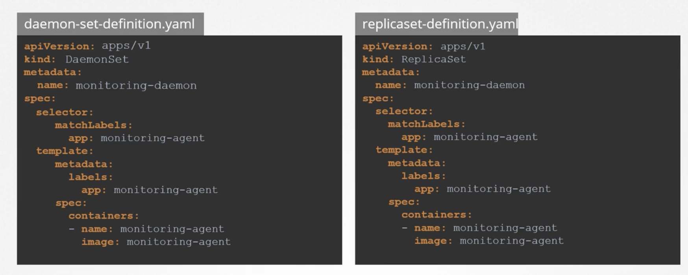
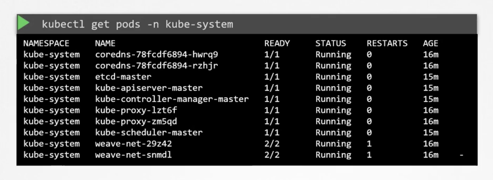

# 71-76

## 71. DaemonSets

- ReplicaSet과 유사하게 Pod을 배포하는 컨트롤러
- 클러스터 내의 모든 노드에 one copy of pod를 배포
- 새 노드가 추가되면 pod를 자동으로 배포
- 노드가 제거되면 pod를 자동으로 제거

Use cases

- 모니터링, 로깅 등 노드에 반드시 필요한 pod를 배포할 때 사용
- Kube-proxy
- Networking: Vivenet 등 네트워크 에이전트

Definition

- ReplicaSet과 유사하게 사용

How does it work?

- ~v1.12: 각 pod에 node name을 지정해서 모든 node에 pod를 생성
- v1.12~: NodeAffinity + default scheduler

## 74. Static Pods

- Worker node의 kubelet이 직접 관리하는 pod
- `/etc/kubernetes/manifests` 디렉토리에 YAML definition을 선언적으로 작성하면 그에 맞게 kubelet이 pod를 생성/삭제/관리
- 오직 pod만 가능. 다른 리소스는 k8s 아키텍쳐와 연관되어 있으며 불가능
- Kubelet이 오직 pod만 이해할 수 있다는 배경이 있음

Path 변경 방법

- kubelet.service 파일의 `--pod-manifest-path` 옵션으로 변경 가능
- `--config` 옵션으로 별도의 설정 파일 위치를 지정하고, 그 파일에 `staticPodPath` 옵션으로 변경 가능

Node 내에서 static pod를 직접 확인하는 방법

- Docker: `docker ps`
- cri-o `crictl ps`
- containerd: `nerdctl ps`

Master node에서 특정 node의 static pod를 확인하는 방법

- Pod는 static pod로 생성하는 방법과 kube-apiserver를 통해 생성하는 방법이 있음
- 둘 다 `kubectl get pods`로 확인 가능
- Kubelet이 static pod를 생성할 때 read-only mirror object를 kube-apiserver에 등록
- 단, static pod는 kube-apiserver로 수정/삭제 불가능

Use cases

- K8s control plane과 독립적이므로, control plane component를 node에 배포할 때 사용
  - 죽더라도 kubelet이 다시 복구시킴
  - kube-admin tool이 pod를 생성할 때 사용
  - control plane component들이 pod로 표시되는 이유임
