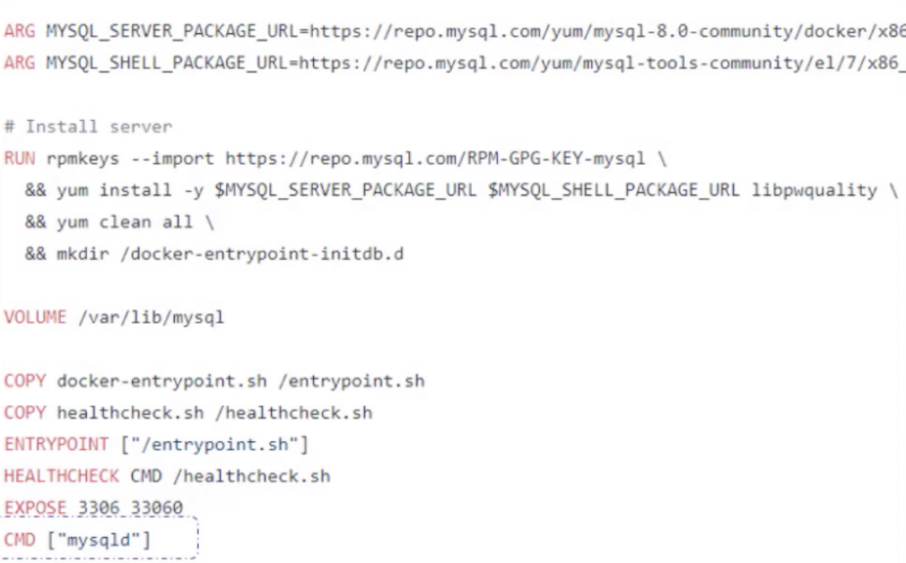

# 95-99

## 95. Configure Applications

Configuring applications comprises of understanding the following concepts:

- Configuring Command and Arguments on applications
- Configuring Environment Variables
- Configuring Secrets

## 96. Commands

Pod def 파일에서의 commands와 arguments를 다룹니다.
자격증에서 필수는 아니지만, 그래도 중요하며 일반적으로 간과되는 내용입니다.

Docker commands, arguments, entry points

Docker에서 `docker run ubuntu`를 하면 컨테이너가 실행 즉시 종료됩니다.
VM은 OS를 호스팅하는 것에 초점을 두지만, 그것과 다르게 container는 특정한 process나 task 수행에 초점을 두기 때문입니다.

- Web server, application server, database 호스팅
- 특정 computation task 수행

태스크가 수행 완료되면 컨테이너가 종료되며, 해당 태스크가 수행되는 동안에만 컨테이너가 생존 상태입니다.

- 웹 서버 종료
- 크래시

그러면 컨테이너에서 어떤 프로세스를 수행할지를 어떻게 결정할까요?
-> **Docker command**

Ubuntn 사례로 되돌아가면

Bash는 서버 프로세스와는 다르게, 터미널로부터의 input을 리스닝합니다.
그리고 터미널이 없다면 종료됩니다.
그런데 Docker는 기본적으로 컨테이너 실행 시 터미널을 attach해주지 않습니다.
따라서 Bash를 실행하면 바로 종료됩니다.

대안 1: override default command

- 일시적인 방법: COMMAND 인자 전달

- 새 Dockerfile을 만들어서 `CMD`를 override합니다.
- 이번엔 숫자가 하드코딩이네요.

- ENTRYPOINT 사용
- 그런데 이러면 인자가 없을 때 실행이 안 됩니다.

- ENTRYPOINT와 CMD를 같이 사용하면 기본 인자를 전달할 수 있습니다.

## 97. Commands and Arguments

Pod def 파일에서의 commands와 arguments를 다룹니다.

- Docker ENTRYPOINT -> Pod command
- Docker CMD -> Pod args
